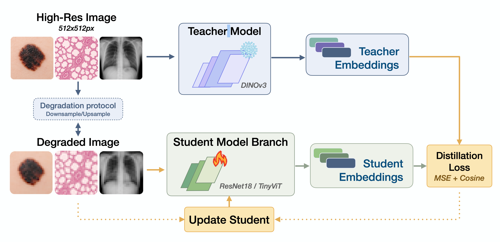

# Med-REDUCE: Representation Transfer and Efficiency Under Resolution Constraints


**Med-REDUCE** is a research framework for studying accuracy-efficiency trade-offs in medical vision models under controlled perceptual degradation (systematic input resolution reduction). It supports three experimental pipelines -- baseline linear probing, embedding distillation, and distilled-student evaluation -- enabling consistent, multi-resolution comparison with comprehensive metric tracking.



The design emphasizes:
- **On-the-fly input transformations** for clean experimental control (downsample at load time, never store degraded copies)
- **Reproducibility** via Hydra configs, persistent train/test splits, and saved seeds
- **Fair comparison** across pipelines through shared splits, identical degradation, and consistent evaluation

The distillation pipeline for Med-REDUCE can be found at https://github.com/Vicbi/med-reduce-distillation.

---

## Datasets

| Domain | Dataset | Classes | Train | Test |
|--------|---------|---------|-------|------|
| Dermatology | [ISIC 2017](https://arxiv.org/pdf/1710.05006) | 3 (nevus, melanoma, seborrheic keratosis) | 2,200 | 550 |
| Radiology | [CheXpert](https://arxiv.org/pdf/1901.07031) | 8 findings (multi-label, curated) | 51,787 | 12,947 |
| Pathology | [TCGA](https://gdc.cancer.gov/about-data) | Binary per task (5 tasks) | 2,542-2,900 | 636-725 |

**Pathology tasks:** LUAD vs LUSC, LGG vs GBM, KRAS, TP53, EGFR

**Cohort locations:** the three cohorts live under `$MR_DATA_ROOT` (default `/scratch/groups/roxanad/datasets`; see [Path Configuration](#path-configuration)). Set `MR_DATA_ROOT` to relocate all three:

| Cohort | Images / data | Labels |
|--------|---------------|--------|
| Dermatology (ISIC 2017) | `$MR_DATA_ROOT/isic/challenges/2017/merged_isic_2017_data/images` | `.../merged_isic_2017_data/merged_ground_truth_part3.csv` |
| Pathology (TCGA) | `$MR_DATA_ROOT/tcga/thumbnails` | `$MR_DATA_ROOT/tcga/tables/dataset.csv` |
| Radiology (CheXpert) | `$MR_DATA_ROOT/chexpert/combined_train_valid_chexpert_v1.0` | `.../chexpert/explore_chexpert/train_valid_combined.csv` |

**Custom datasets:** Prepare an images folder and a labels CSV with `[image_id, label]` columns, then point the config at your `data_dir`, `local_label_file`, `local_label_column`, and `num_labels`.

---

## Quick Start

```bash
# 1. Create and activate virtual environment
python3.10 -m venv .venv
source .venv/bin/activate

# 2. Install PyTorch and project
pip install torch torchvision --index-url https://download.pytorch.org/whl/cu118
pip install -e .

# 3. Run baseline LP (dermatology, 3 seeds, 4 resolutions)
python -m src.cli.run_multiresolution_probe \
    --domain dermatology \
    --model dinov3 \
    --tune-hyperparams \
    --resolutions 512 256 128 64 \
    --seeds 42 123 456 \
    --config configs/probe_two_stage_dermatology
```

---

## Experiment Pipelines

All pipelines use the same persistent train/test splits (managed by `SplitManager`) and run across three seeds (42, 123, 456) for variance estimation.

```
Pipeline A: Baseline LP
  Frozen teacher (DINOv3 / ViT-B/16 / BiomedCLIP) @ each resolution R
  -> cache embeddings -> linear probe -> AUROC

Pipeline B: Distillation
  Frozen teacher @ 512px -> cache teacher embeddings -> train student (ResNet-50/TinyViT)
  end-to-end on degraded images -> save distilled_student.pt

Pipeline C: LP with Distilled Student
  Frozen distilled student @ each resolution R -> cache embeddings -> linear probe -> AUROC
```

---

### Pipeline A: Baseline Linear Probing (frozen teachers)

Evaluates frozen teacher embeddings at multiple resolutions via linear probing. The teacher is chosen with `--model`: `dinov3` (default), `vit` (ViT-B/16), or `biomedclip`. The examples below use `dinov3`; swap the flag to run the other teachers on the same config, for example:

```bash
# Same command with the ViT-B/16 or BiomedCLIP teacher
python -m src.cli.run_multiresolution_probe \
    --domain dermatology --model vit \
    --tune-hyperparams --resolutions 512 256 128 64 --seeds 42 123 456 \
    --config configs/probe_two_stage_dermatology

python -m src.cli.run_multiresolution_probe \
    --domain dermatology --model biomedclip \
    --tune-hyperparams --resolutions 512 256 128 64 --seeds 42 123 456 \
    --config configs/probe_two_stage_dermatology
```

```bash
# Dermatology
python -m src.cli.run_multiresolution_probe \
    --domain dermatology --model dinov3 \
    --tune-hyperparams \
    --resolutions 512 256 128 64 \
    --seeds 42 123 456 \
    --config configs/probe_two_stage_dermatology

# Pathology (per task)
for TASK in luad_vs_lusc lgg_vs_gbm kras tp53 egfr; do
  python -m src.cli.run_multiresolution_probe \
      --domain pathology --model dinov3 \
      --tune-hyperparams \
      --resolutions 512 256 128 64 \
      --seeds 42 123 456 \
      --config configs/probe_two_stage_pathology \
      --extra-overrides "datamodule.task=${TASK}"
done

# Radiology
python -m src.cli.run_multiresolution_probe \
    --domain radiology --model dinov3 \
    --tune-hyperparams \
    --resolutions 512 256 128 64 \
    --seeds 42 123 456 \
    --config configs/probe_two_stage_radiology
```

This automatically:
1. Runs 5-fold CV hyperparameter search at 512px with seed 42
2. Runs final LP at all 4 resolutions for all 3 seeds using the tuned hyperparameters

**Outputs:**
```
{run_dir}/
  seed_42/
    hyperparam_search/{dataset}_{model}/best_hyperparameters.json
    results_{dataset}_{model}_{resolution}px.json
  seed_123/
    results_{dataset}_{model}_*.json
  seed_456/
    results_{dataset}_{model}_*.json
```

---

### Pipeline B: Distillation (Train Student Models)

Distillation lives in the separate **`med-reduce-distillation`** repository (the
Lightning package `med_reduce_distillation`), not in this repo. It trains a
student (ResNet-50 / TinyViT) to match a frozen teacher's embeddings on
resolution-degraded views. See that repo's `jobs/RUN_EXPERIMENTS.md` (Phase B) for
commands.

This repo's role in distillation is only **loading the resulting distilled
checkpoint** for LP evaluation (Pipeline C below).

---

### Pipeline C: LP Evaluation of Distilled Students

Freeze the distilled student backbone and evaluate it through the same LP pipeline as Pipeline A.

```bash
# Dermatology -- ResNet18 distilled
python -m src.cli.run_multiresolution_probe \
    --domain dermatology --model resnet18 \
    --resolutions 512 256 128 64 \
    --seeds 42 123 456 \
    --config configs/probe_two_stage_dermatology \
    --extra-overrides \
      "+model.config.checkpoint_dir=./runs/distillation" \
      "+model.config.checkpoint_pattern=distilled_resnet18.pt"

# Pathology -- ResNet18 distilled (per task)
for TASK in luad_vs_lusc lgg_vs_gbm kras tp53 egfr; do
  python -m src.cli.run_multiresolution_probe \
      --domain pathology --model resnet18 \
      --resolutions 512 256 128 64 \
      --seeds 42 123 456 \
      --config configs/probe_two_stage_pathology \
      --extra-overrides \
        "datamodule.task=${TASK}" \
        "+model.config.checkpoint_dir=./runs/distillation" \
        "+model.config.checkpoint_pattern=distilled_resnet18_${TASK}.pt"
done
```

The `checkpoint_dir` + `checkpoint_pattern` approach automatically resolves per-seed paths (`{checkpoint_dir}/seed_{seed}/{checkpoint_pattern}`).

---

### Split Consistency

All three pipelines use the same `SplitManager` with the same `split_dir` and `seed`, ensuring:
- Identical train/test splits across baseline LP, distillation, and distilled LP
- Results are directly comparable within the same seed
- Variance is estimated across seeds (42, 123, 456)

### Multi-Seed Bootstrap

- **Hyperparameter tuning** runs once with seed 42 (first seed)
- **Final training/evaluation** runs for all seeds (42, 123, 456)
- **Distillation** runs independently per seed (each seed gets its own student checkpoint)

---

## Repository Structure

```
med-reduce/
│
├── configs/                                 # Hydra configuration files
│   ├── probe_two_stage_dermatology.yaml     # LP config for dermatology
│   ├── probe_two_stage_radiology.yaml       # LP config for radiology
│   ├── probe_two_stage_pathology.yaml       # LP config for pathology
│   ├── probe_two_stage_vit.yaml             # LP with ViT backbone
│   ├── probe_two_stage_tcga.yaml            # LP config for TCGA (legacy)
│   ├── config_segmentation.yaml             # Segmentation task config
│   ├── config_segmentation_vit.yaml         # Segmentation with ViT
│   ├── tcga_dataset.yaml                    # TCGA dataset definition
│   └── tcga_dataset_cluster.yaml            # TCGA dataset (cluster paths)
│
├── examples/                                # Standalone example scripts
│   ├── analyze_experiment_results.py        # Post-hoc analysis of metrics & plots
│   └── load_checkpoint_example.py           # Loading a trained checkpoint
│
├── jobs/                                    # SLURM / container job scripts
│   ├── train_container.sh                   # Pipeline A: baseline LP training
│   ├── eval_distilled_container.sh          # Pipeline C: LP eval of distilled students (distillation itself: med-reduce-distillation)
│   ├── setup_container.sh                   # One-time setup: venv + deps
│   ├── slim_container.sh                    # Pull lightweight Python container
│   ├── build_tcga_dataset.sh                # Build TCGA dataset from GDC
│   ├── setup_tcga.sh                        # TCGA-specific setup
│   └── RUN_EXPERIMENTS.md                   # Full run guide (all teachers/pipelines)
│
├── scripts/                                 # Analysis and utility scripts
│   ├── summarize_lp_results.py              # Aggregate LP results (mean +/- SD)
│   ├── dataset_summary.py                   # Dataset size summary table
│   ├── plot_degradation_panel.py            # Visual degradation panel figure
│   ├── merge_isic2017.py                    # ISIC 2017 dataset preparation
│   └── test_transforms.py                   # Test image transformations
│
├── src/                                     # Core library
│   │
│   ├── cli/                                 # Command-line entry points
│   │   ├── run_multiresolution_probe.py     # Multi-resolution LP sweep
│   │   ├── run_probe_two_stage.py           # Two-stage probing runner
│   │   ├── run_experiments.py               # Batch experiment launcher
│   │   ├── run_multiresolution_segmentation.py  # Segmentation sweep
│   │   ├── build_tcga_dataset.py            # TCGA dataset builder
│   │   └── train.py                         # General training entry point
│   │
│   ├── data/                                # Data loading & dataset abstractions
│   │   ├── tabular_datamodule_persistent.py # Tabular datamodule with persistent caching
│   │   ├── tcga_datamodule.py               # TCGA pathology datamodule
│   │   ├── isic_datamodule.py               # ISIC dermatology datamodule
│   │   ├── datamodule.py                    # Base datamodule
│   │   ├── embedding_dataset.py             # Dataset backed by cached embeddings
│   │   ├── dataset_factory.py               # Factory for dataset selection
│   │   ├── datasets.py                      # Dataset definitions
│   │   ├── isic_loader.py                   # Raw ISIC image loading
│   │   └── data_utils.py                    # Shared helpers
│   │
│   ├── engines/                             # Training & evaluation engines
│   │   ├── linear_probe_embedding_engine.py # LP on cached embeddings (+ per-label AUROC)
│   │   ├── linear_probe_engine.py           # LP on frozen features
│   │   ├── classification_metrics.py        # Shared AUROC / macro-F1 computation
│   │   ├── segmentation_engine.py           # Segmentation training loop
│   │   └── training_core.py                 # Shared training loop logic
│   │
│   ├── evaluation/                          # Metrics and analysis
│   │   ├── aggregate_results.py             # Cross-seed result aggregation
│   │   ├── analyze_results.py               # Analysis logic
│   │   ├── compare_embeddings.py            # Embedding comparison utilities
│   │   ├── metrics_collector.py             # Metric persistence (JSON/CSV)
│   │   └── segmentation_metrics.py          # Segmentation-specific metrics
│   │
│   ├── losses/                              # Loss functions
│   │   ├── classification.py                # Classification losses
│   │   └── distillation.py                  # Embedding distillation loss (MSE + cosine)
│   │
│   ├── models/                              # Model definitions & factory
│   │   ├── factory.py                       # Model factory / registry (DINOv3, timm, ViT)
│   │   ├── dinov3.py                        # DINOv3 backbone wrapper
│   │   ├── dinov3_feature_detection.py      # DINOv3 feature detection
│   │   ├── dinov3_segmentation.py           # DINOv3 for segmentation
│   │   └── vit_segmentation.py              # ViT for segmentation
│   │
│   ├── transformations/                     # Input-space transformations
│   │   └── transforms.py                    # ResolutionReductionTransform (lazy, on-the-fly)
│   │
│   ├── utils/                               # General utilities
│   │   ├── split_manager.py                 # Persistent train/test split management
│   │   ├── embedding_cache.py               # Embedding caching (per model/seed/resolution)
│   │   ├── teacher_cache.py                 # Teacher embedding cache (used by probe_cv / segmentation CV)
│   │   ├── checkpoint_utils.py              # Checkpoint save/load helpers
│   │   ├── reproducibility.py               # Seed setting, deterministic mode
│   │   ├── logging_core.py                  # Logging configuration
│   │   ├── optim.py                         # Optimizer utilities
│   │   ├── training_utils.py                # Training helpers
│   │   ├── callbacks_hf.py                  # HuggingFace callbacks
│   │   ├── constants.py                     # Shared constants
│   │   └── utils.py                         # Misc utilities
│   │
│   └── wrappers/                            # High-level experiment orchestrators
│       ├── probe_two_stage.py               # Two-stage LP pipeline (HP search + eval)
│       ├── probe_cv.py                      # Cross-validation probing
│       └── segmentation_cv.py               # Cross-validation segmentation
│
├── pyproject.toml
├── requirements.txt
├── LICENSE
└── README.md
```

---

## Installation

```bash
# Create virtual environment
python3.10 -m venv .venv
source .venv/bin/activate

# Install PyTorch with CUDA (adjust for your CUDA version)
pip install torch torchvision --index-url https://download.pytorch.org/whl/cu118

# Install project and dependencies
pip install -e .

# For development tools (optional)
pip install -e ".[dev]"
```

For containerized or HPC runs, see [Running on HPC](#running-on-hpc-sherlock).

---

## Supported Models

Med-REDUCE evaluates **three frozen teachers** spanning three pretraining paradigms, plus two distilled **students**. The teacher (or student) is selected with the `--model` key; the domain config is shared across all of them.

| Model Key | Architecture | Source | Role |
|-----------|-------------|--------|------|
| `dinov3` | DINOv3 ViT-S/16 (21M) | `facebook/dinov3-vits16-pretrain-lvd1689m` | **Teacher** -- self-supervised (default). Gated: requires HF token |
| `vit` | ViT-B/16 (86M) | `google/vit-base-patch16-224` | **Teacher** -- supervised ImageNet-21k. Fixed 224px grid |
| `biomedclip` | BiomedCLIP ViT-B/16 (86M) | `hf-hub:microsoft/BiomedCLIP-PubMedBERT_256-vit_base_patch16_224` | **Teacher** -- medical vision-language. Fixed 224px grid; needs `open_clip` |
| `dinov2` | DINOv2 ViT-S/14 | `facebook/dinov2-small` | Alternative teacher |
| `resnet50` | ResNet-50 (25M) | timm | Distilled student |
| `resnet18` | ResNet-18 | timm | Distilled student (smaller) |
| `tiny_vit_21m_224` | TinyViT-21M | timm | Distilled student |

Both 86M teachers (`vit`, `biomedclip`) use a fixed 224px positional-embedding grid, so their native resolution is pinned to 224 while the degradation target R still sweeps the 512/256/128/64 ladder. Only `dinov3` is a gated model; `vit` and `biomedclip` are openly downloadable (BiomedCLIP additionally requires the `open_clip` package).

---

## Running on HPC (Sherlock)

### Prerequisites: HuggingFace Authentication

DINOv3 is a gated model. To use it:

1. **Request access** at [facebook/dinov3-vits16-pretrain-lvd1689m](https://huggingface.co/facebook/dinov3-vits16-pretrain-lvd1689m)
2. **Create a token** at [HuggingFace Settings > Access Tokens](https://huggingface.co/settings/tokens) (Read permissions)
3. **Save the token** on the cluster:
   ```bash
   cd /scratch/users/$USER/med-reduce
   mkdir -p .huggingface
   echo "hf_your_token_here" > .huggingface/token
   chmod 600 .huggingface/token
   ```

### HPC Setup

```bash
# One-time setup (creates venv, installs deps)
sbatch jobs/setup_container.sh
tail -f logs/setup_env_*.out
```

### Running All Pipelines

```bash
# Pipeline A: Baseline LP
DOMAIN=dermatology sbatch jobs/train_container.sh
DOMAIN=pathology   sbatch jobs/train_container.sh
DOMAIN=radiology   sbatch jobs/train_container.sh

# Pipeline B: Distillation — run from the med-reduce-distillation repo
#   (see med-reduce-distillation/scripts/run_pipeline_container.sh and
#    jobs/RUN_EXPERIMENTS.md Phase B)

# Pipeline C: LP eval of distilled students (after B completes)
DOMAIN=dermatology sbatch jobs/eval_distilled_container.sh
DOMAIN=pathology   sbatch jobs/eval_distilled_container.sh
DOMAIN=radiology   sbatch jobs/eval_distilled_container.sh
```

### Job Environment Variables

| Variable | Default | Description |
|----------|---------|-------------|
| `DOMAIN` | (required) | `dermatology`, `radiology`, or `pathology` |
| `MODEL` | `dinov3` | Teacher model for LP |
| `STUDENT` | `resnet18` | Student model for distillation |
| `SEEDS` | `42 123 456` | Bootstrap seeds |
| `RESOLUTIONS` | `512 256 128 64` | LP resolutions |
| `TASKS` | all 5 TCGA tasks | Pathology tasks (pathology only) |
| `EXTRAS` | (empty) | Extra Hydra overrides (e.g., `runtime.run_dir=...`) |
| `CHECKPOINT_DIR` | (empty) | Dir with distilled checkpoints (Pipeline C) |

### Path Configuration

All dataset and output locations are parameterized through environment variables so the
code runs on any machine without editing configs. Each variable falls back to the original
cluster path when unset, so existing runs are unaffected; set them to point at your own
storage. Configs read them via OmegaConf (`${oc.env:VAR,default}`); scripts read them directly.

| Variable | Default | Description |
|----------|---------|-------------|
| `MR_DATA_ROOT` | `/scratch/groups/roxanad/datasets` | Root of the read-only datasets (ISIC, CheXpert, TCGA) |
| `MR_RESULTS_ROOT` | per-domain `/scratch/users/<user>/med-reduce-*-results` | Writable root for runs, splits, and the embedding cache |
| `MR_RESULTS_CLEAN` | `results-med-reduce-clean` | Curated results tree read by the figure scripts (`scripts/plot_*.py`) |
| `MR_PAPER_DIR` | `.` | Output directory for generated figures |
| `MR_CHEXPERT_DST` | `/oak/.../$USER/processed_chexpert` | Destination for the CheXpert preprocessing copy step |
| `SCRATCH_GROUP` | `/scratch/groups/roxanad` | Group scratch root used by the TCGA dataset-build jobs |

Example (point everything at local storage):

```bash
export MR_DATA_ROOT=/data/med-reduce/datasets
export MR_RESULTS_ROOT=/data/med-reduce/results
```

### Training Budget

| Pipeline | Estimate | Details |
|----------|----------|---------|
| Baseline LP (HP tuning) | ~3-4h | 18 configs x 5-fold CV |
| Baseline LP (final probing) | ~1-2h | 3 seeds x 4 resolutions |
| Distillation (per student) | ~4-6h | 3 seeds x 100 epochs |
| LP with distilled student | ~1-2h | 3 seeds x 4 resolutions |

Resources: 1 GPU, 48 GB RAM, 8 CPUs, 12h wall time.

### Troubleshooting

| Problem | Fix |
|---------|-----|
| Container not found | `./jobs/slim_container.sh` |
| Mount error (pip_cache) | `mkdir -p /scratch/users/$USER/pip_cache` |
| venv not found | `sbatch jobs/setup_container.sh` |
| DINOv3 access denied | Check `.huggingface/token` exists and has valid HF token |

---

## License

MIT
